# Adam image

## Table of contents

- [Introduction](#introduction)
- [Upgrade](#upgrade)
- [Fresh installation](#fresh-installation)
- [Content installation](#content-installation)
    - [External microSD format and label](#external-microsd-format-and-label)
    - [ROMs](#roms)
    - [Previews](#previews)
    - [BIOS](#bios)
    - [Cheats](#cheats)
    - [System access](#system-access)
- [Controls](#controls)
- [Problem solving](#problem-solving)
- [FAQ](#faq)
- [Telegram channel for updates](#telegram-channel-for-updates)

## Introduction

Internal card (INT slot) setup for Ingenic JZ4770 chip-based portable emulation consoles (specifically those mentioned in the description of [this commit](https://github.com/OpenDingux/linux/commit/8fdd85c7198ab553dcbb36d3d62441fc9b655ed3)), i.e. RG350, RG280, RG300X and PlayGo/PocketGo2 v2 consoles. Result of a collaboration project of Team RParadise formed by:

* [Brumagix Gamer](https://www.youtube.com/channel/UCrdNisYjDd7qI1Zv2ZLwBrQ)
* [eduardófilo](https://apuntes.eduardofilo.es/)
* Juanmote (Juanma)
* [La Retro Cueva](https://www.youtube.com/channel/UCQm1VwD4sFoOUx6rq-at7jA)

The setup is made based on the following parts:

* [OpenDingux](http://od.abstraction.se/opendingux/latest/). Mainly thanks to [pcercuei](https://github.com/pcercuei).
* [SimpleMenu](https://github.com/fgl82/simplemenu). Thanks to [FGL82](https://github.com/fgl82). With this themes:
    * [0A](https://github.com/fgl82/0A). Thanks to [FGL82](https://github.com/fgl82).
    * [BigCody](https://github.com/fgl82/BigCody). Thanks to [FGL82](https://github.com/fgl82).
    * [ComicBook320x240](https://github.com/retrogamecorps/ComicBook320x240) and [ComicBook](https://github.com/retrogamecorps/ComicBook). Thanks to [retrogamecorps](https://github.com/retrogamecorps).
    * [SimUI](https://github.com/dkodr/SimUI). Thanks to [dkodr](https://github.com/dkodr).
* [RetroArch](https://www.retroarch.com/?page=platforms). The combination of OPK wrappers has been built with script [RG3550_auto_ra_installer](https://github.com/eduardofilo/RG350_auto_ra_installer) based on [this definition file](https://github.com/eduardofilo/RG350_auto_ra_installer/blob/master/adam.csv).
    * [Oficial](https://buildbot.libretro.com/nightly/dingux/mips32/).  Mainly thanks to [jdgleaver](https://github.com/jdgleaver).
    * [Poligraf](https://github.com/Poligraf/opendingux_ra_cores_unofficial). Thanks to [Poligraf](https://github.com/Poligraf).
* Standalone applications:
    * [ColecoD](https://boards.dingoonity.org/gcw-releases/colecod-v1-0/). Thanks to [alekmaul](https://github.com/alekmaul).
    * [Daphne](https://github.com/DavidKnight247/Daphne). Thanks to [DavidKnight247](https://github.com/DavidKnight247).
    * [FBA](https://github.com/plrguez/fba-sdl/releases/latest). Thanks to [plrguez](https://github.com/plrguez).
    * [JzIntv](https://github.com/eduardofilo/jzIntv/releases). Thanks to [DavidKnight247](https://github.com/DavidKnight247).
    * [PCSX4All](https://github.com/jdgleaver/RG350_pcsx4all/releases/latest). Thanks to [jdgleaver](https://github.com/jdgleaver).
    * [PocketSNES](https://github.com/m45t3r/PocketSNES/releases/latest). Thanks to [m45t3r](https://github.com/m45t3r).
    * [ReGBA](https://github.com/jdgleaver/ReGBA/releases/latest). Thanks to [jdgleaver](https://github.com/jdgleaver).
    * [Tac08](https://0xcafed00d.itch.io/tac08-rg350). Thanks to [0xCAFED00D](https://itch.io/profile/0xcafed00d).
    * [VbEmu](https://gitlab.com/gameblabla/gameblabla-releases/-/blob/master/opk/gcw0/vbemu_gcw0.opk). Thanks to [gameblabla](https://gitlab.com/gameblabla).
    * [xMAME](http://www.slaanesh.net/). Thanks to [Slaanesh](https://www.blogger.com/profile/15791750842821351775). Installed [this](https://github.com/eduardofilo/RG350_xmame_sm_bridge) settings interface.
    * [BeebEm](https://github.com/plrguez/beebem-od). Thanks to [plrguez](https://github.com/plrguez).
    * [ScummVM](https://github.com/goldmojo/scummvm-rg350). Thanks to [goldmojo](https://github.com/goldmojo).
    * [Commander](https://github.com/od-contrib/commander/releases/latest). Thanks to [glebm](https://github.com/glebm).
    * [PyBackup](https://github.com/eduardofilo/RG350_py_backup/releases/latest)

## Upgrade

If you have been using the console with the previous version of the image, surely we are interested in saving the savestates of the games we have played and some personal settings. So, **BEFORE** flashing the latest version of the image, some of these things should be backed up. To facilitate this task, the `Py Backup` application can be used, which is described [here](https://github.com/eduardofilo/RG350_py_backup/blob/master/README.md) and comes preconfigured with the most important files that should be periodically backed up.

Due to changes in the Py Backup configuration file between versions 1.1 and 1.2, the update procedure from 1.1 version is slightly complicated by having to replace that file before making the backup. In the following video we can see the entire upgrade process from image v1.1 to v1.2.

[](https://www.youtube.com/watch?v=Qih9NzvCCHg "See video")

If we update from 1.2 to 1.3 we can skip the first 6 steps of the previous video, that is, start at step 7.

**IMPORTANT WARNING**: Due to changes in the internal format of the files stored in `rom_preferences` and `favorites.sav` in version 11 of SimpleMenu installed from image 1.3, the backup copies of these files from a previous version should not be restored. The `rom_preferences` actually have not changed the internal format of the files but does their location. Before they were all in the root of that same directory and now they go in subdirectories with the name of the corresponding system. Therefore, with a little attention, a backup of these files could be used, but it would be necessary to do the restoration manually or move the files to the directories where SimpleMenu is now going to look for them.

## Fresh installation

1. Download the dump file from the [releases section of this repository](https://github.com/eduardofilo/RG350_adam_image/releases/latest).
2. Flash the file (`img.xz`) without decompressing with [Balena Etcher](https://www.balena.io/etcher/) on a microSD card of at least 4GB.
3. Mount the microSD in a computer. If we just flashed it, depending on the operating system, it may be necessary to remove it from the reader and reinsert it. In Windows, one of the two partitions containing the card will be mounted and the other will give an error. The error is normal since the second partition is Linux type.
4. Place the kernel suitable to the console model. This can be done in several ways depending on the PC operating system.

#### Windows

1. Open the `select_kernel.bat` script on the partition mounted correctly, by double clicking on it.

    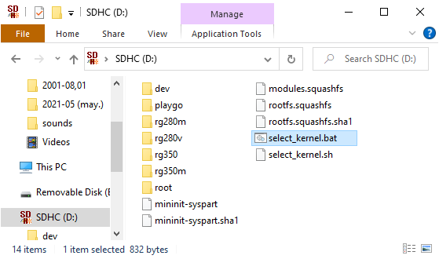

2. A console will appear where we will have to type the number corresponding to our console model from the list.

    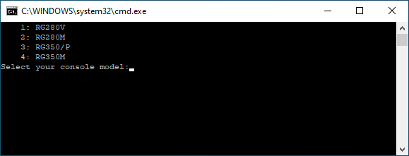

3. Press Return and, when prompted, eject the card safely.

    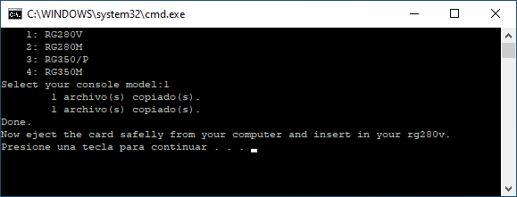

#### Linux

1. Open a terminal and change the current directory to the path corresponding to partition 1 of the card (we can find out the mount point on our system with the `df` command). From that directory run the command `bash select_kernel.sh`.

    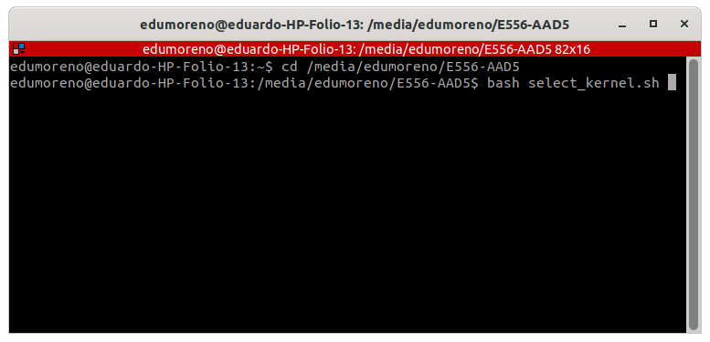

2. A dialog will appear inviting us to select our console model with the cursor keys.

    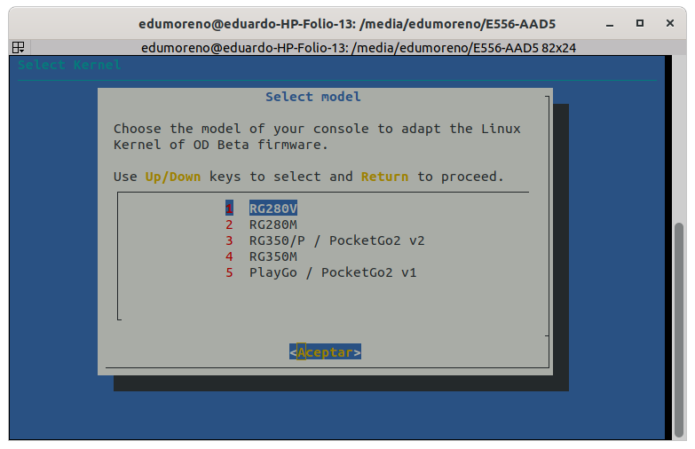

3. Press Return and, when prompted, eject the card safely.

    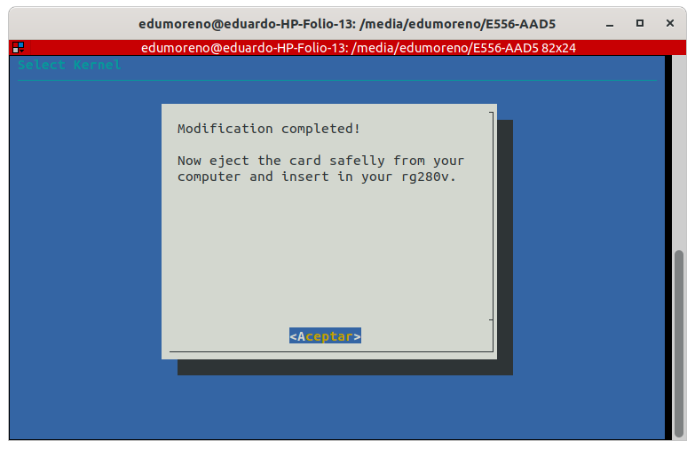

#### Any system

There is a third method valid for any operating system (Windows, Linux, Mac). The idea is to view partition 1 of the card with a file explorer and manually copy the two files in the directory corresponding to our console model to the root of that partition. Being a FAT32 partition, there should be no problem accessing the files from any system. Click on the following thumbnail to see a small video.

[](https://www.youtube.com/watch?v=CQSBWOTO2zc "See video")

At this point, the card will be ready to work on the console model that we have selected in the previous procedure. If we have not already done yet, we will safely eject it from the PC and insert the card into the console slot marked with INT.

The above procedure can be repeated to change to another console model at any time. That is, the image is compatible with the four supported console models, so the same card will serve us for several machines.

Partition 2 contained in the image file has about 3.5GB (so it can be flashed without problems on cards with a capacity of 4GB or greater). In this version of the image, this partition will not auto expand to fill the available space on the card. If you want to do it (although it is not necessary since the heavy contents go on the EXT card), it can be done with the [DiskGenius](https://www.diskgenius.com/) utilities for Windows or [GParted](https://gparted.org/) for Linux.

In the first part of this video from [Retro Game Corps](https://www.youtube.com/channel/UCoZQiN0o7f36H7PaW4fVhFw) we can see the installation process:

[](https://www.youtube.com/watch?v=kdIdiQ-dO_Y "See video")

## Content installation

The card that we have just prepared is empty of contents. It only contains the OpenDingux system, the SimpleMenu frontend, the RetroArch cores, and a few standalone emulators. All the configuration has been done with the idea that the contents are provided from the card that we will place in the slot marked with EXT.

Before continuing, we will make a brief comment on the legal considerations of installing such contents. The matter is complex. If you are interested, a good article is [this Retro Game Corps post](https://retrogamecorps.com/2020/08/18/legal-guide-is-downloading-retro-game-files-roms-illegal/). Although there are few legal precedents on the subject, the problem primarily affects BIOS and ROMs. In a simplified way, it is usually considered that we can handle the ROMs of the games and the BIOS of the machines that we own. Actually it is more of a rule based on common sense, since as we say, there are few legal sentences on the subject and of course the opinion of the different participants in the industry is not consistent.

### External microSD format and label

For all the preconfigured paths in the setup to work, the external microSD card needs to be in FAT32 format and **NOT** have label defined. In case of having a label, it will have to be removed.

In Windows we can do it from the Properties box of the unit where the external card is mounted. Click on the following thumbnail to see a small video.

[](https://www.youtube.com/watch?v=3uAMibsOvvk "Ver vídeo")

In Linux it can be done by executing the following command from a terminal (in the example the device `/dev/mmcblk0p1` has been used, but it will have to be replaced by the one that corresponds in our case):

```bash
sudo fatlabel /dev/mmcblk0p1 -r
```

If you have a Mac, for now the best option is the one described in the [Retro Game Corps Starter Guide](https://retrogamecorps.com/2021/08/20/rg350-rg280-series-starter-guide/#Setup), contributed by @Asppire and which is transcribed below:

> “Erase” the disk using the Mac’s built-in Disk Utility app, with the format MS-DOS (FAT), name it whatever you want. Then, on the left side of the Disk Utility app you should see the SD card. Right-click on it and select “Rename” and now delete the name and just press the SPACE bar once so that the name looks blank. On the device, it will register as being blank and work appropriately.

### ROMs

The SimpleMenu frontend has been configured with a series of predefined paths where it will try to locate the ROMs and graphical previews. These routes will be created on the EXT card each time the system boots (if they do not exist). This process will only work if, as we said in the previous section, the card format is FAT32 and it does **NOT** have a label. If we do not want to modify the SimpleMenu configuration, we will have to stick to these paths. In the table below, the name of the directory that will have to exist on the external card when we mount it on the PC is indicated in the second column. For example, in the following screenshot the ROMs directory of the Game Boy system is selected, which as we can see, is located next to all the others within the `roms` folder at the root of the card.

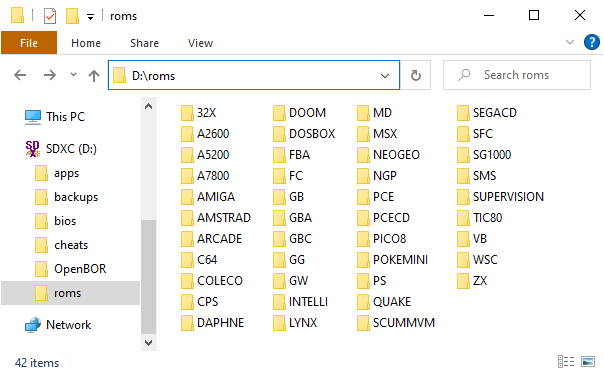

The above path on the PC will correspond to `/media/sdcard/roms` on the console system, once the card is in the console and the system has booted. In case of modifying the SimpleMenu configuration, or manually opening the emulators from GMenu2X, this will be the kind of path that we will use (`/media/sdcard/roms/GB` for Game Boy for instance).

Below is the table of the systems configured in SimpleMenu with the paths where we must place the ROMs and the supported extensions.

|System|Paths|Supported extensions|
|:------|:-----------------|:---------------------|
|MAME|roms/ARCADE|zip, 7z|
|Capcom Play System|roms/CPS|zip, 7z|
|Final Burn Alpha|roms/FBA|zip|
|Daphne|roms/DAPHNE|zip|
|Nintendo NES|roms/FC|nes, zip, 7z|
|Nintendo Famicom Disk System|roms/FDS|fds, zip, 7z|
|Nintendo SNES|roms/SFC|smc, sfc, zip, 7z|
|Nintendo Virtual Boy|roms/VB|vb, vboy, bin, zip, 7z|
|SEGA SG-1000|roms/SG1000|zip, sg, 7z|
|SEGA Master System|roms/SMS|zip, sms, 7z|
|SEGA Megadrive|roms/MD|zip, bin, smd, md, mdx, gen, 7z|
|SEGA CD|roms/SEGACD|bin, chd, cue|
|SEGA 32X|roms/32X|zip, 32x, 7z|
|Atari 2600|roms/A2600|bin, a26, zip, 7z|
|Atari 5200|roms/A5200|bin, a52, zip, 7z|
|Atari 7800|roms/A7800|bin, a78, zip, 7z|
|Inteillivision|roms/INTELLI|int|
|ColecoVision|roms/COLECO|rom, col|
|SNK Neo Geo|roms/NEOGEO|zip, 7z|
|NEC PC Engine|roms/PCE|pce, tg16, cue, zip, 7z|
|NEC PC Engine CD|roms/PCECD|pce, tg16, cue, chd, zip, 7z|
|Sony PlayStation|roms/PS|mdf, zip, pbp, cue, bin, img, ccd, sub, chd|
|Nintendo Game Boy|roms/GB|gb, gz, zip, 7z|
|Nintendo Game Boy Color|roms/GBC|gbc, zip, 7z|
|Nintendo Game Boy Advance|roms/GBA|gba, zip, 7z|
|Nintendo Game&Watch|roms/GW|mgw, zip, 7z|
|SEGA Game Gear|roms/GG|zip, gg, 7z|
|Atari Lynx|roms/LYNX|zip, lnx, 7z|
|SNK Neo Geo Pocket|roms/NGP|ngp, ngc, 7z, zip|
|WonderSwan|roms/WSC|ws, wsc, zip, 7z|
|Pokemon Mini|roms/POKEMINI|min, zip, 7z|
|Watara Supervision|roms/SUPERVISION|sv, bin, 7z, zip|
|Sinclair ZX Spectrum|roms/ZX|tzx, tap, z80, rzx, scl, trd, dsk, zip, 7z|
|Amstrad CPC|roms/AMSTRAD|dsk, sna, tap, cdt, voc, cpr, m3u, zip, 7z|
|Commodore 64|roms/C64|crt, d64, t64, bin, 7z, zip|
|MSX|roms/MSX|rom, ri, mx1, mx2, col, dsk, cas, sg, sc, m3u, zip, 7z|
|Commodore Amiga|roms/AMIGA|adf, adz, dms, fdi, ipf, hdf, hdz, lha, slave, info, cue, ccd, nrg, mds, iso, chd, uae, m3u, zip, 7z, rp9|
|Doom|roms/DOOM/DOOM, roms/DOOM/DOOM2|wad, zip, 7z|
|Quake|roms/QUAKE|pak, zip, 7z|
|MS-DOS|roms/DOSBOX|zip, dosz, exe, com, bat, iso, cue, ins, img, ima, vhd, m3u, m3u8, 7z|
|ScummVM|roms/SCUMMVM|svm|
|Pico8|roms/PICO8|png|
|TIC80|roms/TIC80|tic, 7z, zip|
|BBC Micro|roms/BBCMICRO|ssd, dsd, uef|

Some comments about the supported extensions:

* PlayStation: ROMs in `cue+bin` format do not work compressed in ZIP. On the contrary, in `iso` format, they do open when they are supplied compressed in ZIP.
* ScummVM: ScummVM games are made up of several files, so they will have to be kept in directories. The extension `svm` indicated in the former list corresponds to an empty file whose name is the ID of the game that we will extract from [this list](https://www.scummvm.org/compatibility/) and that we will place in the directory where we have the rest of the game files. For example, for the game "The Secret of Monkey Island" we will need the files that we can consult in the [ScummVM wiki](https://wiki.scummvm.org/index.php?title=Category:Supported_Games). Specifically for this game [we see](https://wiki.scummvm.org/index.php?title=The_Secret_of_Monkey_Island) that we will need the files `MONKEY.000` and `MONKEY.001` that we will place in a directory of any name within the directory configured in SimpleMenu (`<EXT_SD>/roms/SCUMMVM`). It will be in this same directory where we will have to place the empty file `svm`. According to the ScummVM compatibility list, the ID of "The Secret of Monkey Island" is `monkey`, so the file that we will place inside the game directory will be `monkey.svm`. Finally, if we want SimpleMenu to show the full name of the game, we will only have to incorporate an entry like the following in the SimpleMenu alias file (`/home/media/data/local/.simplemenu/alias.txt`):

    ```
    monkey=The Secret of Monkey Island
    ```

### Previews

The previews should be placed in a directory with name `.previews` within each of the ROM directories in the previous list. For example, the previews of GB should be located in `roms/GB/.previews`, this being the path from the root of the external card when mounted in the PC. The preview files have to be PNGs with the same name as the game (except for the extension).


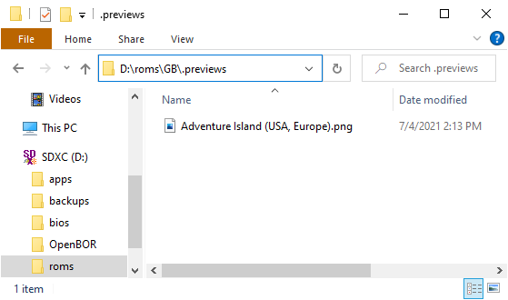

If we have followed the paths indicated above, later in SimpleMenu the game will be represented as follows:

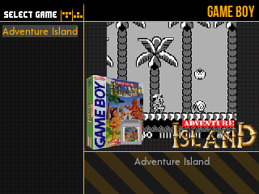

### BIOS

All the emulators installed in the image (RetroArch included) have redirected the paths where the BIOS should be to the `bios` directory on the external card. Similar to the case of ROMs, the `bios` directory at the root of the external card will correspond to the path `/media/sdcard/bios` on the console system.

Not all emulators need BIOS. This is the case of machines that did not have it or whose function has been emulated. The following is the BIOS file name and path where we will have to install it. To help identify the correct files, its size in bytes and an MD5 hash are indicated if it is known. The cases in which the BIOS is essential for the emulator to work are also marked. If 'NO' is indicated, the emulator will work, but still it is recommended to install the BIOS in order to achieve the best compatibility. To check MD5 hashes, the cross-platform utility [Quickhash](https://www.quickhash-gui.org/) is recommended.

The sizes and hashes indicated are from BIOS that have been proven functional, but not necessarily the only possible ones. That is, in some machines there are several possible BIOS versions, usually because there have been several models of the machines (the case of the PlayStation being one of the most typical), or because someone has developed BIOS with improved capabilities (here the typical example is that of Neo Geo and his UNIBIOS).

|System|Path|Size|MD5 hash|Needed?|
|:------|:---|-----:|:-------|:----------|
|Atari 5200|bios/5200.rom|2048|`281f20ea4320404ec820fb7ec0693b38`|Yes|
|Atari 7800|bios/7800 BIOS (U).rom| |`0763f1ffb006ddbe32e52d497ee848ae`|No|
|SEGACD|bios/bios_CD_E.bin|131072|`e66fa1dc5820d254611fdcdba0662372`|Yes|
|SEGACD|bios/bios_CD_J.bin|131072|`278a9397d192149e84e820ac621a8edd`|Yes|
|SEGACD|bios/bios_CD_U.bin|131072|`854b9150240a198070150e4566ae1290`|Yes|
|Intellivision|bios/exec.bin|8192|`62e761035cb657903761800f4437b8af`|Yes|
|Intellivision|bios/grom.bin|2048|`0cd5946c6473e42e8e4c2137785e427f`|Yes|
|PC Engine CD|bios/syscard3.pce|262144|`390815d3d1a184a9e73adc91ba55f2bb`|Yes|
|Commodore Amiga|bios/kick34005.A500|262144|`82a21c1890cae844b3df741f2762d48d`|Yes on Amiga 500|
|Commodore Amiga|bios/kick37175.A500|524288|`dc10d7bdd1b6f450773dfb558477c230`|Yes on Amiga 500+|
|Commodore Amiga|bios/kick40063.A600|524288|`e40a5dfb3d017ba8779faba30cbd1c8e`|Yes on Amiga 600|
|Commodore Amiga|bios/kick40068.A1200|524288|`646773759326fbac3b2311fd8c8793ee`|Yes on Amiga 1200|
|Commodore Amiga|bios/kick40060.CD32|524288|`5f8924d013dd57a89cf349f4cdedc6b1`|No|
|Commodore Amiga|bios/kick40060.CD32.ext|524288|`bb72565701b1b6faece07d68ea5da639`|No|
|Atari Lynx|bios/lynxboot.img|512|`fcd403db69f54290b51035d82f835e7b`|Yes|
|Phillips Videopac|bios/o2rom.bin|1024|`562d5ebf9e030a40d6fabfc2f33139fd`|Yes|
|SNK Neo Geo|roms/NEOGEO/neogeo.zip| | |Yes|
|Nintendo GBA|bios/gba_bios.bin|16384|`a860e8c0b6d573d191e4ec7db1b1e4f6`|No, although recommended|
|PlayStation|bios/SCPH1001.BIN|524288|`924e392ed05558ffdb115408c263dccf`|Yes, since the HLE BIOS has been disabled in the PCSX4All configuration|
|Nintendo GB|bios/gb_bios.bin|256|`32fbbd84168d3482956eb3c5051637f5`|No|
|Nintendo GBC|bios/gbc_bios.bin|2304|`dbfce9db9deaa2567f6a84fde55f9680`|No|
|Pokemon Mini|bios/bios.min|4096|`1e4fb124a3a886865acb574f388c803d`|Yes|
|MSX (BlueMSX)|bios/Machines/| | |Yes|
|MSX (fMSX)|bios/MSX.ROM|32768|`364a1a579fe5cb8dba54519bcfcdac0d`|Yes on MSX|
|MSX (fMSX)|bios/MSX2.ROM| |`ec3a01c91f24fbddcbcab0ad301bc9ef`|Yes on MSX2|
|MSX (fMSX)|bios/MSX2EXT.ROM| |`2183c2aff17cf4297bdb496de78c2e8a`|Yes on MSX2|
|MSX (fMSX)|bios/MSX2P.ROM|32768|`847cc025ffae665487940ff2639540e5`|Yes on MSX2+|
|MSX (fMSX)|bios/MSX2PEXT.ROM|16384|`7c8243c71d8f143b2531f01afa6a05dc`|Yes on MSX2+|
|BBC Micro|bios/acorn_dnfs|16384|`5daed103918277e2065dd7e8d23e57a5`|Yes|
|BBC Micro|bios/basic|16384|`2cc67be4624df4dc66617742571a8e3d`|Yes|
|BBC Micro|bios/os12|16384|`0a59a5ba15fe8557b5f7fee32bbd393a`|Yes|
|Famicom Disk System|bios/disksys.rom|8192|`ca30b50f880eb660a320674ed365ef7a`|Yes|

### Cheats

RetroArch has a built-in cheat system based on a series of files that can be obtained from [this repository](https://github.com/libretro/libretro-database/tree/master/cht). In the image, the directory where we have to place the files has been redirected to the EXT card, as with the ROMs and BIOS. Specifically to the `cheats` directory at the root of the EXT card.

We are going to detail the process using the Game Boy game `Adventure Island` as an example:

1. We will look for the corresponding file in the [repository](https://github.com/libretro/libretro-database/tree/master/cht). Specifically for this game the file is [this](https://github.com/libretro/libretro-database/blob/master/cht/Nintendo%20-%20Game%20Boy/Adventure%20Island%20(USA%2C%20Europe).cht).
2. We will copy it to the `cheats` directory at the root of the EXT card. Actually, the most logical thing is to copy complete collections of systems, keeping the directory structure that we see in the repository.
3. Once the console is booted with the EXT card in place, we will open the game with RetroArch.
4. We access the RetroArch menu (`Select + X` or `Power`).
5. We follow the route: `Quick Menu > Cheats > Load Cheat File (Replace)`.
6. A file browser will appear showing the contents of the `cheats` folder on the EXT card. We locate the file corresponding to the game and select it.

    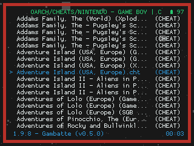

7. We will return to the Cheats screen where we will see that the bottom part has been loaded with the cheats. There we can adjust the ones we want (quick adjustment is done with the left/right keys).
8. Finally we select `Apply Changes`.

    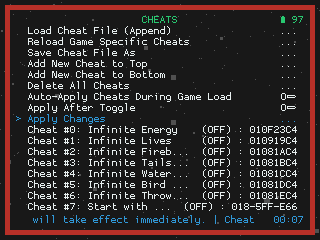

9. If we want the cheat settings we have made to apply between different game sessions, we will have to make an override to the game.

More details on [this guide](https://retrogamecorps.com/2020/12/24/guide-retroarch-on-rg350-and-rg280-devices/#Cheats) by Retro Game Corps.

PCSX4All also supports a cheat system. As in RetroArch, the directory where we have to place the files has been redirected to the external card. Specifically to the `cheats/PlayStation` directory at the root of the external card. Keep in mind that the cheats for PCSX4All do not have the same format as those for `Sony - PlayStation` in the repository that we have indicated before to get cheats for RetroArch.

### System access

Once the card with the system (INT) and the contents (EXT) have been inserted in their corresponding slots, and the console turned on, we can access the system by SSH to make some customizations that require this type of access (such as editing SimpleMenu or Py Backup configuration files). To achieve access by SSH we will connect the console with an USB type C cable to the computer using the same connector that is used for charging (that is, the one marked with DC). In Windows, it may be necessary to install [drivers](https://github.com/SeongGino/RetroGame350-AppRepo/blob/master/RG350-signed_driver.zip). In case of problems installing this drivers, see [this video](https://www.youtube.com/watch?v=Ib5qfYv6ijc).

On the computer we can use any FTP client configured with the SFTP or SCP protocol (for example WinSCP or Filezilla). Access through the normal SSH protocol can be achieved from a simple console or terminal either on Windows or Linux, by typing the following command:

```
ssh od@10.1.1.2
```

The password for `od` user is `untoqebboqvboqudrn`. If you want to change or disable it, you must use the `Password` application (only accessible from GMenu2X in the `settings` section).

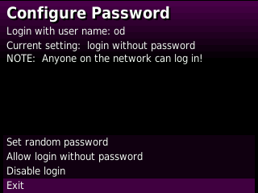

By default the image is configured to make use of USB access in `Ethernet > RNDIS` mode, although with `USB Mode` application, we can switch to `Mass Storage` (MTP) or `Ethernet > ECM`.

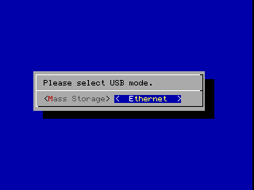
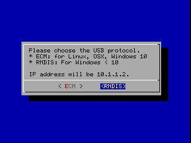

## Controls

Here are some cool shortcuts that can be used with the OpenDingux system, SimpleMenu, RetroArch, and standalone emulators.

|Context|Shorcut|Function|
|:--------|:---------------|:-----|
|OpenDingux|Hold Power|Power off|
|OpenDingux|Power + Start + Select|Reboot|
|OpenDingux|Power + Select|Kill current app|
|OpenDingux|Power + UP|Volume up|
|OpenDingux|Power + DOWN|Volume down|
|OpenDingux|Power + RIGHT|Brightness up|
|OpenDingux|Power + LEFT|Brightness down|
|OpenDingux|Power + A|Hardware scaling ratio mode|
|OpenDingux|Power + B|Mouse mode (formerly POWER + L1)|
|OpenDingux|Power + Y|Sleep mode (tap POWER to resume)|
|OpenDingux|Power + X|take screenshot (on ~/screenshots)|
|OpenDingux|A (while powering on)|It'll skip the logo and show the output of the init scripts|
|OpenDingux|Select (while powering on)|Boot mode. Check [this guide](https://boards.dingoonity.org/retrominirs-90/a-quick-guide-to-flashing-opendingux-on-the-rs-90-using-windows-10-x64/msg186557/#msg186557)|
|SimpleMenu|Start|Brings up the Settings screen|
|SimpleMenu|Select|ROM options. Let's you select autolaunch, emulator (if multiple emulators are defined for the selected section) and overclocking|
|SimpleMenu|Up|Selects the previous game/section/group|
|SimpleMenu|Down|Selects the next game/section/group|
|SimpleMenu|Left|Skips to the previous page in the current section|
|SimpleMenu|Right|Skips to the next page in the current section|
|SimpleMenu|R1|Switches between menu and fullscreen mode|
|SimpleMenu|R2|Refreshes the current section (in case you added some ROMs while the menu is running)|
|SimpleMenu|A|Launches a game/program|
|SimpleMenu|B|If pressed and released, it takes you one screen back. If pressed and held, it acts as a hotkey to be combined with other keys|
|SimpleMenu|X|On regular sections, marks a game as a favorite, on the favorites section, it takes it off from the favorites list|
|SimpleMenu|Y|Goes to the favorites section|
|SimpleMenu|B + Left|Skips to the previous letter|
|SimpleMenu|B + Right|Skips to the next letter|
|SimpleMenu|B + Up|Goes to the previous section, without showing the logo|
|SimpleMenu|B + Down|Goes to the next section, without showing the logo|
|SimpleMenu|B + Select|Random select|
|SimpleMenu|B + X|Deletes the selected rom **WITHOUT ASKING FOR CONFIRMATION**. Doesn't work on the favorites section or in the Apps and Games section|
|SimpleMenu|B + A|Launches the emulator itself instead of a rom, if it supports to be run as a standalone application|
|RetroArch|Select + A|Pause|
|RetroArch|Select + B|Reset|
|RetroArch|Select + X or Power|RetroArch Menu. In some cores (`G&W` for example) the `Select + X` shortcut collides with the core's own shortcuts; use `Power` in that case.|
|RetroArch|Select + Y|Fast forward|
|RetroArch|Select + R1|Savestate save|
|RetroArch|Select + L1|Savestate load|
|RetroArch|Select + R2|Swap disc|
|RetroArch|Select + L2|Open CD tray|
|RetroArch|Select + Start|Quit|
|RetroArch|Select + Left/Right|Change savestate slot|
|RetroArch|Select + Up/Down|Volume change|
|RetroArch/Neo Geo FBA|Hold Start|UniBIOS settings|
|RetroArch/CPS2|R2 or R3|Test menu on some games|
|RetroArch/Famicom Disk System|L1|Disk side change|
|RetroArch/Famicom Disk System|R1|Insert/eject disk|
|FBA (MAME, FBA and CPS)|L1 + R1 + Start or Power|Open emulator menu that allows us to quit|
|FBA (MAME, FBA and CPS)|L1 + R1 + Y|Show/hide FPS counter|
|FBA (MAME, FBA and CPS)|L1 + R1 + B|Savestate save|
|FBA (MAME, FBA and CPS)|L1 + R1 + A|Savestate load|
|FBA (MAME, FBA and CPS)|Select|Insert coin|
|FBA (MAME, FBA and CPS)|Start|Start Player 1|
|FBA (MAME, FBA and CPS)|Select + Start|Start Player 2|
|xMAME|Select + L1 + R1|Quit|
|xMAME|Start + R1|Show/hide FPS counter|
|Daphne|L1|Insert coin|
|Daphne|Start|Start game|
|Daphne|Select|Quit|
|PocketSNES (SNES)|Select + Start or Power|Open emulator menu that allows us to quit|
|ReGBA (GBA)|Select + Start or Power|Open emulator menu that allows us to quit|
|PCSX4All (PlayStation)|Select + Start or Power|Open emulator menu that allows us to quit|
|JzIntv|Select|Open emulator menu that allows us to quit|
|JzIntv|Power|Quit|
|JzIntv|R1|Virtual controller|
|JzIntv|L1|Virtual keyboard|
|ColecoD (ColecoVision)|Select + Start|Open emulator menu that allows us to quit|
|Tac08 (PICO8)|Start|Open emulator menu that allows us to quit|
|Fuse (ZX Spectrum)|Select|Virtual keyboard|
|Cap32 (AMSTRAD CPC)|Y + Start|Virtual keyboard. Once displayed, open/close the RA menu (Select + X) so that the left stick starts working as a mouse|
|Vice 64 (Commodore 64)|Select|Virtual keyboard|
|PUAE (Commodores Amiga)|L1|Virtual keyboard|
|BeebEm (BBC Micro)|L1|Open emulator menu that allows us to quit|
|BeebEm (BBC Micro)|R1|Virtual keyboard|

Don't miss [this cheatsheet](resources/Adam.Image.Cheatsheet.v1.3.pdf) made by @iammeat that includes all the above controls in a much more convenient format.

## Problem solving

#### Unsupported video mode

Some RetroArch cores show the following error screen when working in resolutions not supported by the system:

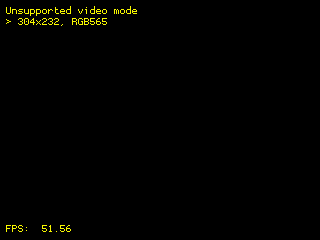

These cases many times are solved by activating a filter and playing with the video scaling options. One of the filters that usually works well is: `Upscale_256x-320x240`. The complete procedure to make these changes would be:

1. Open RetroArch menu (`Select + X`).
2. Go to `Main Menu > Settings > Video > Scaling` and check `Integer Scale` and `Keep Aspect Ratio` options.

    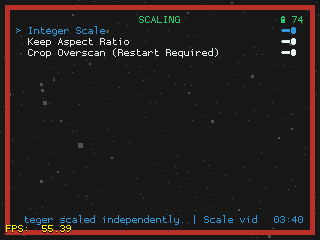

3. Go to `Main Menu > Settings > Video > Video Filter` and select `Upscale_256x-320x240.filt` filter (last on the list):

    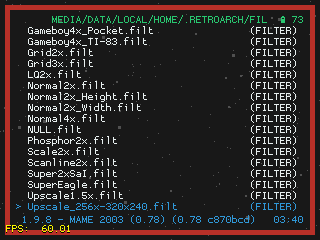

Finally, to not make this change every time you open the game, go to `Main Menu > Quick Menu > Overrides` and select `Save Game Overrides`.

Another filter that usually works well in these situations is `LQ2x`.

#### Applications force closing

If the application or emulator that we were running hangs, it can be forced to close by pressing the key combination `Power + Select`. It is important to press the keys in that order, that is, press a little before `Power` and without releasing it then press` Select`. If this key combination does not work either, hold down the `Power` key for a few seconds to cause a controlled shutdown of the console.


In summary, the methods to close an application or emulator are:

1. First try normal closing (`Power + Select` for example in RetroArch).
2. If the above does not work, `Power + Select`.
3. If the above does not work, hold down `Power` a few seconds until the system shuts down.

Avoid pressing `Reset` as it has been found quite often to cause SD corruption.

#### OC risks

Another situation that leads to SD corruption in some users is overclocking. Thus, whenever it is going to try, it is recommended to make a backup of the savestates and configurations that we do not want to lose with [Py Backup](https://github.com/eduardofilo/RG350_py_backup/blob/master/README.md).

#### Emulator selection

In the SimpleMenu configuration, many of the systems offer several emulator options, that is, you can choose between several emulators or RetroArch cores. Also the preferred emulator or core can be saved for each game.

In simple systems, such as 8-bit machines, only RetroArch has been configured, considering it the best option. But in more complex systems, such as arcade, the offer of emulators is wide. For example, in MAME, the following options are available:

* RetroArch MAME2003 core
* RetroArch MAME2003+ core
* FBA
* xMAME romset 84
* xMAME romset 69
* xMAME romset 52

The emulation options appear in this order in the list, the first being the default option if you do not manually specify an emulator for a specific game. Therefore, if left unchanged, the default option for running MAME games will be the MAME2003 RetroArch core.

If a specific game does not work with the default emulator, press `Select` in the SimpleMenu games list. A selector will appear with three options, the third one being the emulator to use. We will move to this third option and change the emulator by pressing left/right. To save the change we will press `Select` again. When opening the game by pressing `A` the emulator or RA core that we have chosen will be launched. If the new emulator is not working properly, try another option until you get good performance.

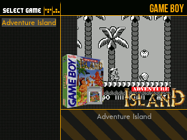

Another situation in which we should change the emulator option is when the game runs slow. In addition to the choppy sound, the best way to measure if the game is moving fast enough is to activate the frames per second or FPS counter. In RetroArch we can activate the option for a particular game in the menu `Main Menu > Settings > On-Screen Display > On-Screen Notifications > Notification Visibility > Display Framerate`, but if we want to activate it in general, we must first close the content that we are executing. This would be the procedure described in detail.

1. Launch any game that runs with RetroArch (for example, all Handheld systems are configured with RetroArch by default).
2. Open RetroArch meny pressing `Select + X`.
3. Select `Close Content` menu.
4. Follow the path: `Main Menu > Settings > On-Screen Display > On-Screen Notifications > Notification Visibility`.
5. Enable `Display Framerate`.
6. Go back to the Main Menu by pressing `B` repeatedly.
7. Open `Configuration File` menu.
8. Invoke `Save Current Configuration` command.
9. Go back to the Main Menu by pressing `B` once.
10. Invoke `Quit RetroArch` command.

To deactivate it, we will proceed in the same way but deactivating the option in step 5.

In xMAME the FPS option is activated/deactivated at any time by pressing `Start + R1`. In FBA the shortcut is `L1 + R1 + Y`.

A special case is that of the CPS system. In this image, it has been chosen to combine CPS1 and CPS2 in the same system (there is no RetroArch core for CPS3 and in general it is a system for which the machines that can use this image do not have enough power). It has been preferred to do this way due to the reduced number of games on both systems and because of the facilities that SimpleMenu offers to select the core that we want to use for each game. Thus, in this system (or rather in the union of CPS1 and CPS2 systems), it will be essential to make the adjustment in the CPS2 games. The core of CPS1 is the default and therefore it will only be necessary to adjust those of CPS2. The complete list of CPS2 games is as follows (the name of the ROM .zip file is indicated, not the actual name of the game). Thanks to @ridsama for putting together the list:

```
1944, 19xx, armwar, avsp, batcir, choko, csclub, cybots, ddsom, ddtod, dimahoo, dstlk, ecofghtr, gigawing, hsf2, megaman2, mmatrix, mpang, mshvsf, msh, mvsc, nwarr, progear, pzloop2, ringdest, sfa2, sfa3, sfa, sfz2al, sgemf, spf2t, ssf2t, ssf2, vhunt2, vsav2, vsav, xmcota, xmvsf
```

#### Console does not boot after flashing

Most likely, the kernel installation procedure described [here](#install-from-scratch) has not been performed. If the console is booted without the kernel installed, the green power LED lights dimly. In this situation, the console cannot be turned off (unless we disconnect the battery or wait for it to discharge completely). It has been verified that in some cards, even if we remove the card, install the kernel, reinsert it and press RESET, it will still not boot. In these situations, the only way that has been found to get out of the vicious circle (apart from the idea mentioned before disconnecting the battery or waiting for it to discharge completely) is to insert another card that does not give this problem, press RESET and after system boot on this card, shutdown normally. If now we insert the first newly flashed card where the kernel installation procedure has been performed, this time (with a cold boot of the machine) it will boot normally.

#### Console cannot be powered off

We refer to the situation where we try to power off the console using the GMenu2X `Power off` launcher or the SimpleMenu `Shutdown` command. All cases of this type found have been related to spontaneous reboots of the system, usually after entering and exiting sleep mode several times. From that spontaneous restart, the console could not be turned off, that is, it would restart by itself when trying to power it off. The solution is to use the Reset. To avoid corruptions of the system card, it is recommended to press Reset just when the system finishes shutting down (we can be guided by when the screen goes black). An example of the phenomenon and its solution can be seen in the following video:

[](https://www.youtube.com/watch?v=hf4fGnCjfTw "See video")

## FAQ

#### Q1: Should I reflash every time a new image appears? Perhaps you have an OPK for a more streamlined update?

A1: I'm sorry. At the moment only the flashing method is available. In the past with another image, I published an OPK to make the update, but give me many problems because user tweaks made it difficult to apply the patches. The complete procedure to upgrade between one version of the image and the next one is described [here](#upgrade).

#### Q2: Is there a battery level indicator?

A2: Since version v1.1, SimpleMenu shows battery level on some themes (0A and SimUI). You have also battery level when running RetroArch and entering in the menu (`Power` or `Select + X`). At last, you can exit to GMenu2X from SimpleMenu changing `Default launcher` option to `no` and then selecting `Session: quit`.

#### Q3: Why are the override settings in RetroArch not preserved?

A3: The key in this topic is to understand well the three levels of overrides that exists. If you change a setting and override it at the core level, but then there is an override on the same setting at the content level, the first will not be applied because the second takes precedence. [This guide](https://docs.libretro.com/guides/overrides/) is valuable.

We are going to show an example of one of these cases that is most often asked. It is about activating the option to keep the aspect ratio in GB or GBC. We are going to look at GBC in particular, so in the following greps we do not have to take into account the file `GB.cfg`. That option is called `video_dingux_ipu_keep_aspect` in RA config files. This is the default situation of that setting on the different files that apply, as they are in the image just flashed:

```
rg280v:~/.retroarch $ grep video_dingux_ipu_keep_aspect retroarch.cfg
video_dingux_ipu_keep_aspect = "true"
rg280v:~/.retroarch $ grep video_dingux_ipu_keep_aspect config/Gambatte/*
config/Gambatte/GB.cfg:video_dingux_ipu_keep_aspect = "false"
config/Gambatte/GBC.cfg:video_dingux_ipu_keep_aspect = "false"
config/Gambatte/Gambatte.cfg:video_dingux_ipu_keep_aspect = "false"
```

In words, the `Keep Aspect Ratio` setting is enabled at a general level (first grep), but then disabled in overrides at the core and content level (second grep).

The logical thing would be that activating it at the content level would start to work, but RetroArch applies a system of economy of settings and when it sees that an adjustment at any level, matches the general adjustment, it simply removes the override adjustment. As a result, when setting this option to `true` and then creating the override at the content level, what actually happens is that the override is lost and the core level is applied, which, as can be seen, is still `false`.

```
rg280v:~/.retroarch $ grep video_dingux_ipu_keep_aspect retroarch.cfg
video_dingux_ipu_keep_aspect = "true"
rg280v:~/.retroarch $ grep video_dingux_ipu_keep_aspect config/Gambatte/*
config/Gambatte/GB.cfg:video_dingux_ipu_keep_aspect = "false"
config/Gambatte/Gambatte.cfg:video_dingux_ipu_keep_aspect = "false"
```

The solution is to make another override at the core level (which erases the adjustment at that level as well), leaving only the general adjustment.

```
rg280v:~/.retroarch $ grep video_dingux_ipu_keep_aspect retroarch.cfg
video_dingux_ipu_keep_aspect = "true"
rg280v:~/.retroarch $ grep video_dingux_ipu_keep_aspect config/Gambatte/*
config/Gambatte/GB.cfg:video_dingux_ipu_keep_aspect = "false"
```

In short, you have to activate the keep aspect ratio and save the overrides at the core and content level at same time. It is a mess yes.

#### Q4: How can I reset the RetroArch configuration so that I can mount my own overrides without being affected by the ones in the image?

A4: Just delete `/media/data/local/home/.retroarch/config` directory and `/media/data/local/home/.retroarch/retroarch.cfg` file.

#### Q5: NeoGeo ROMs with FBA standalone emulator do not sync screen well on RG350M (I guess on RG3300X neither). How can it be fixed?

A5: This is a problem with the hardware scaling that this emulator does when you have that screen. The solution is to disable it through the FBA interface itself or UX. To do this, temporarily disable SimpleMenu as the default launcher, open the `FBA UX` emulator from GMenu2X, locate the game that we want to adjust (it may be necessary to add the path of the NEOGEO ROMs to `ROMs Paths`), open it and in the Option menu that appears change `Hardware scaling` to `Off`. The change is saved at the game level so if we later launch it from SimpleMenu, it will be applied even if we do not go through that intermediate settings screen.

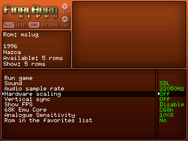

If you don't want to make the fix game by game, you can change it in `Main settings > Default ROM settings > Default Run Game settings > Hardware scaling`, but keep in mind that this change will affect games from other systems that did not have problems with scaling.

#### Q6: I can't modify RetroArch config, error `Failed saving config to...` is displayed

A6: To modify the general configuration of RetroArch, there must be no content (ROM) loaded. This can be done in a number of ways:

1. After launching RetroArch through a ROM, open RA menu (`Power` or `Select + X`) and use the `Close Content` command.
2. Open the RetroArch launcher. In image versions 1.2 or earlier, it can only be done from GMenu2X, in the `emulators` section. As of 1.3 there is also a launcher in the `Apps` section of SimpleMenu.

In any case, it is not usual to manipulate the general configuration of RetroArch. What most of the time is convenient is to override at the core, content (directory) or game level. Check FAQ number 3 for more details.

#### Q7: How can I lower the minimum volume without actually muting the sound? The minimum is still very high.

This problem affects mainly to RG280V. That is because in that machine the speakers are connected directly to the DAC (digital analog converter) and not to the chain DAC->Headphone port like in other devices. In RG280V the volume control is only affected by PCM channel in `alsamixer`, and even at its minimum value before the mute (32 / -30dB) is heard too loud in a quiet environment.

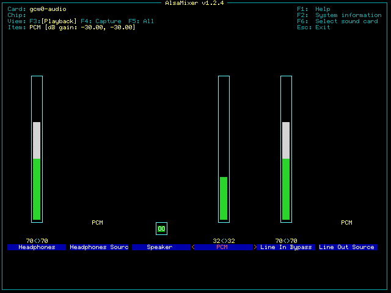

Without touching the system, the only thing that can be done is to play with the sound options that some of the emulators may have. Fortunately RetroArch includes in the audio settings the possibility of attenuating the output. The setting is found in the path: `MAIN MENU > Settings > Audio > Volume Gain (dB)`. The `-10dB` value has been found to be a good balance, so setting the minimum system volume before mute is already adequate, and the maximum is powerful enough. If we choose to make this adjustment, it is best to do it at the general configuration level, for which we must follow the steps commented in [FAQ number 6](#q6-i-cant-modify-retroarch-config-error-failed-saving-config-to-is-displayed).

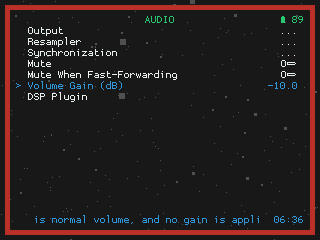

## Telegram channel for updates

Join this Telegram channel to get update notifications: https://t.me/adam_image
