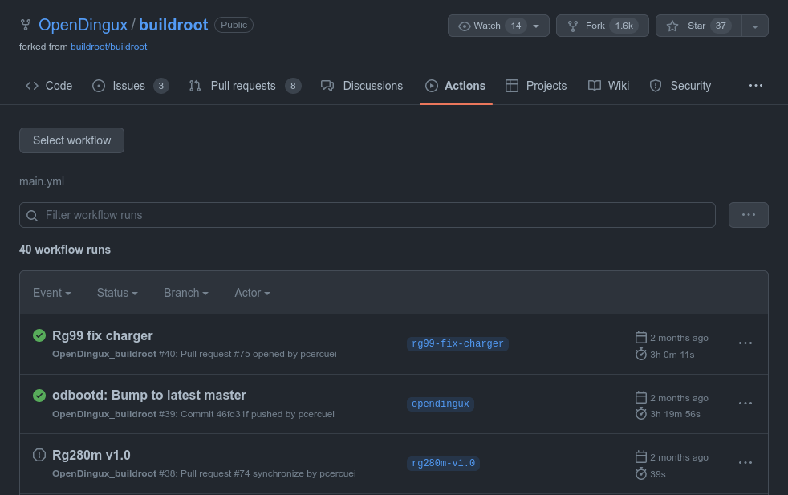
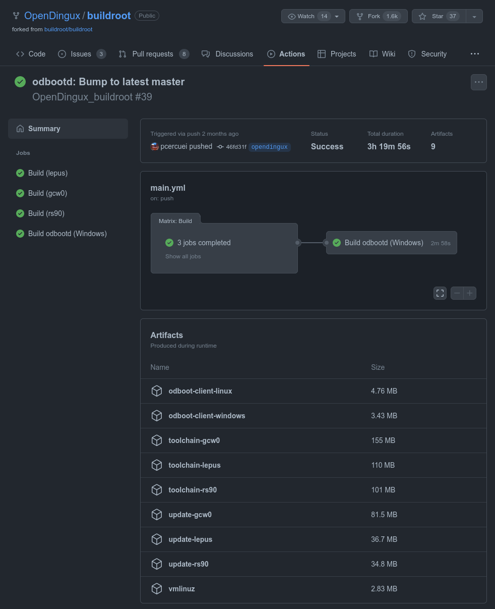

# Imagen Adán

La imagen Adán es una compilación de software para la tarjeta microSD interna de una serie de consolas portátiles de emulación basadas en el chip Ingenic JZ4770. Concretamente GCW-Zero, PocketGo2 v1/v2, Anbernic RG350, RG280 y RG300X.

Si sólo te interesa utilizar una de las imágenes publicadas en las [releases](https://github.com/eduardofilo/RG350_adam_image/releases), consulta la documentación en el [wiki](https://github.com/eduardofilo/RG350_adam_image/wiki).

## Compilación

Si quieres construir la imagen desde sus fuentes, el procedimiento básico es el siguiente:

1. Descargar el repositorio con sus submódulos (**IMPORTANTE**: no olvidar la opción `--recursive`):

    ```
    git clone --recursive https://github.com/eduardofilo/RG350_adam_image.git
    cd RG350_adam_image
    ```

2. Modificar los parámetros que hay al principio del script `build.sh` de compilación de la imagen según conveniencia:

    ```
    ## ODbeta params
    ODBETA_DOWNLOAD_PLAN="A"        # "A": Descarga directa; "B": Artifact de GHAction
    ODBETA_VERSION=2022-02-13       # Versión de ODbeta a instalar. Debe corresponder con la descarga directa o GHArtifact
    ### For plan "A"
    ODBETA_DIR_URL=http://od.abstraction.se/opendingux/26145a93f2e17d0df86ae20b7af455ea155e169c
    ### For plan "B"
    ODBETA_ARTIFACT_ID=287825131    # ID del artefacto `update-gcw0` en la última ejecución del workflow del branch `opendingux`
                                    # del repositorio https://github.com/OpenDingux/buildroot
    GITHUB_ACCOUNT=PUT_HERE_YOUR_GITHUB_ACCOUNT
    GITHUB_TOKEN=PUT_HERE_A_GITHUB_TOKEN
    ## Other params
    MAKE_PGv1=true                  # Construir imagen para GCW-Zero y PocketGo2 v1 (true/false)
    MAKE_RG=true                    # Construir imagen para RG350 y derivadas (true/false)
    COMP=xz                         # Formato de compresión: gz o xz
    P1_SIZE_SECTOR=819168           # Tamaño de la partición 1 en sectores (819168 sectores= ~400M)
    SIZE_M=3200                     # Tamaño final de la imagen en MiB
    ```

3. Modificar el contenido del directorio `data` si se quieren hacer cambios a los contenidos de la partición 2 de la tarjeta INT.
4. Compilar la imagen:

    ```
    ./build.sh
    ```

5. La imagen construida, lista para flashear se encontrará en el directorio `releases`.

## Descarga de OPK de instalación de ODbeta

Los primeros parámetros comentados en el punto 2 de la lista anterior están relacionados con la descarga del OPK de instalación de ODBeta que puede obtenerse de dos lugares:

* Plan "A": Descarga directa del sitio [http://od.abstraction.se/opendingux/](http://od.abstraction.se/opendingux/). Para este plan sólo hay que localizar el directorio donde se encuentra el OPK que nos interesa y asignar su URL al parámetro `ODBETA_DIR_URL`. Dentro de ese directorio debe encontrarse el OPK con la fecha en el nombre que hayamos asignado al parámetro `ODBETA_VERSION`.
* Plan "B": Obtenido de los artefactos de la ejecución de actions en el repositorio Github `OpenDingux/buildroot`. Hay dos alternativas para que la descarga funcione bien sobre el script de compilación de la imagen Adán. Las vemos a continuación.

#### Descarga manual

Descargar manualmente el OPK buscándolo en la ejecución más reciente del workflow `OpenDingux_buildroot` de los actions del repositorio `OpenDingux/buildroot` correspondiente al branch `opendingux`. Por ejemplo en el momento de escribir este texto esto es lo que se podía encontrar en el repositorio:



En este caso abriríamos la ejecución del workflow de nombre `odbootd: Bump to latest master` que nos llevaría a la siguiente pantalla:



Pinchando en el artefacto de nombre `update-gcw0` obtendríamos el OPK de actualización de ODbeta comprimido en zip. Sólo queda extraer el fichero que contiene (de nombre `gcw0-update-2022-04-03.opk` en este caso), dejarlo en el directorio `select_kernel` del repositorio de la imagen y ajustar el parámetro `ODBETA_VERSION` para que se corresponda con la fecha que contiene el nombre del OPK que acabamos de descargar.

Si a la hora de ejecutar el script de compilación de la imagen `build.sh`, se encuentra el OPK que corresponda al parámetro `ODBETA_VERSION`, el script se saltará el proceso de descarga. En ese caso no será necesario ajustar los parámetros `ODBETA_ARTIFACT_ID`, `GITHUB_ACCOUNT` y `GITHUB_TOKEN`.

#### Descarga automatizada

En este caso el script de compilación de la imagen `build.sh` intentará descargar el OPK de instalación de ODbeta. Para ello es imprescindible ajustar correctamente los parámetros `ODBETA_ARTIFACT_ID`, `ODBETA_VERSION`, `GITHUB_ACCOUNT` y `GITHUB_TOKEN`.

Para obtener el token que hay que indicar en el parámetro `GITHUB_TOKEN` acudir a la siguiente ruta una vez que hayamos iniciado sesión en Github: `Settings > Developer settings > Personal access tokens`. Allí pulsar sobre `Generate new token` y generar un token con el scope `workflow` (automáticamente se seleccionará el scope `repo`).

## Canal Telegram para comunicar actualizaciones

Se ha creado este canal de Telegram para comunicar más fácilmente las actualizaciones de esta imagen: https://t.me/adam_image
